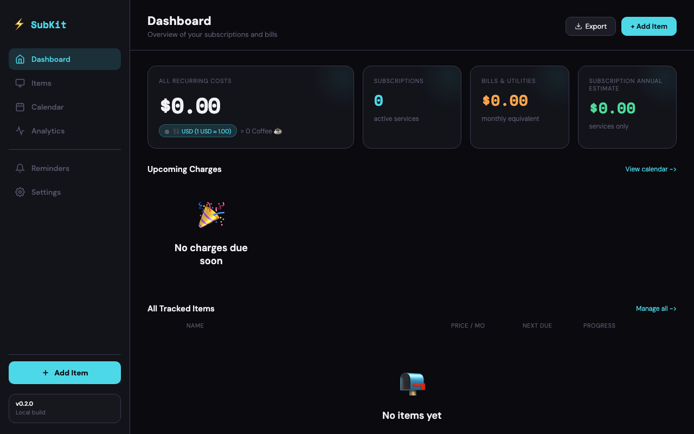
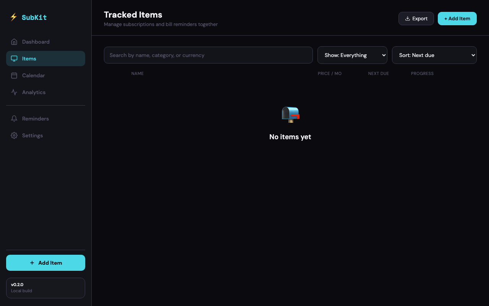
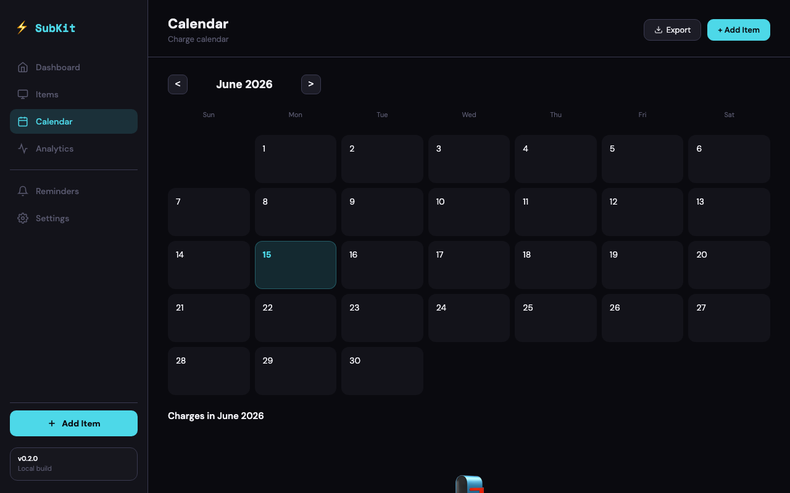
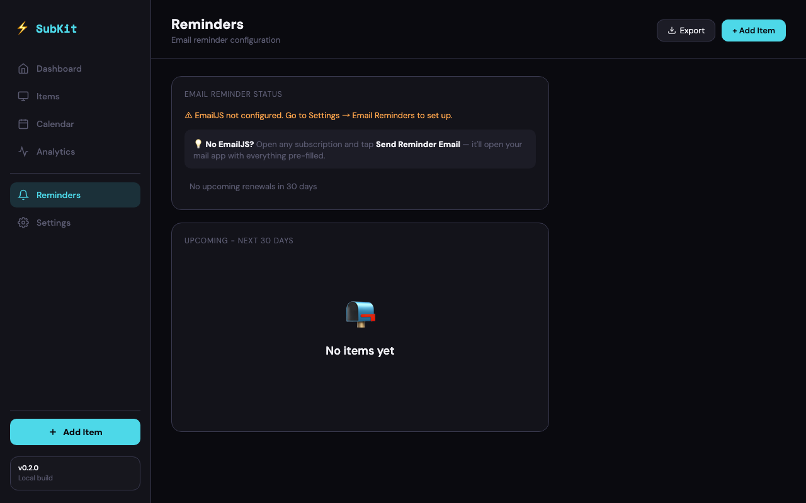
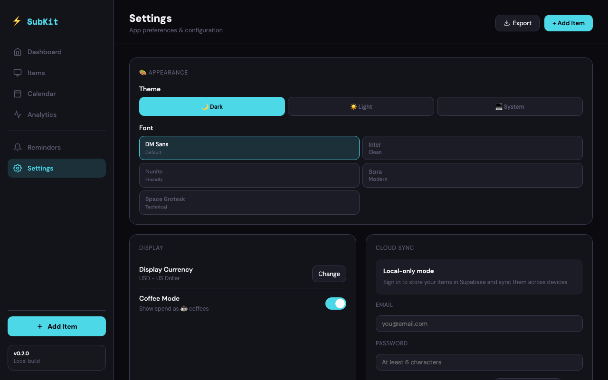

# Final integration smoke — codex/remediation-2026-06

**Date:** 2026-06-15
**Branch:** `codex/remediation-2026-06` (vs `origin/main`)
**Verifier:** mvs_226faf8230374b699bd603cc1bcbb35a
**Browser:** Chromium headless (Playwright 1.60.0-alpha, isolated user-data-dir to avoid clashing with the long-lived mcp-chrome-8a5a286 session)
**Verdict:** **FAIL** (one console-error criterion, see "Failure" section)

---

## Summary

The 3 producer tracks (`readme-and-secrets-doc`, `index-html-hardening`, `edge-function-hardening`) integrate cleanly at the file level — no conflicts, no regressions between them. The app loads, all 5 main tabs render, the Telegram escape function is present and correctly neutralizes XSS payloads in a real call, the GitHub OAuth button is clickable and triggers the redirect, the README is real and well-structured, the migration is well-formed.

The smoke is **failing on a single strict-criterion check**: the producer's CSP meta tag contains `frame-ancestors 'none'`, which the HTML spec does not allow in `<meta>` elements. Chromium reports this as a `console.error` on every page load. It is a known spec limitation (MDN: *"This directive is not supported in the `<meta>` element"*) and not a regression introduced by the integration, but the task criterion says "Any console error" → fail.

**Fix (one line):** remove `frame-ancestors 'none';` from the CSP meta in `index.html:9`. The directive has been silently inert since the producer added it; removing it eliminates the console error without losing any actual security protection (the directive wasn't doing anything in meta form anyway). A proper frame-ancestors policy would need a Vercel `headers` config or an HTTP server emitting CSP as a response header.

---

## Step-by-step results

### Step 1: Branch state — PASS

**Method:** `git log --oneline origin/main..HEAD` and `git diff --stat origin/main..HEAD` from repo root on `codex/remediation-2026-06`.

**Evidence:**
```
c4c8b67 docs: trim README to focus on Quick start + Security model + Roadmap
a2bfb85 send-reminders: extract typed helper + handleRequest, add deno test rig
43272d3 Prevent double-send of same-day reminders via unique partial index
ecc0a62 send-reminders: process EmailJS calls with bounded concurrency
a9acbad Add CSP meta, Telegram HTML escape, supabase defensive load, stale-rates indicator
d690809 docs: replace placeholder README with real documentation
```

```
 README.md                                          | 89 ++++++++++++++++++++-
 index.html                                         | 69 +++++++++++++----
 supabase/functions/send-reminders/deno.json        |  3 +
 supabase/functions/send-reminders/deno.lock        | 55 +++++++++++++
 supabase/functions/send-reminders/effectiveAmount.test.ts | 69 ++++++++++++++++
 supabase/functions/send-reminders/index.ts         | 90 ++++++++++++++++++----
 supabase/migrations/20260615090000_unique_reminder_per_day.sql | 8 ++
 7 files changed, 356 insertions(+), 27 deletions(-)
```

All 7 expected files present. 6 commits on the branch.

**Result: PASS**

---

### Step 2: App loads in real browser — FAIL (one console error)

**Method:** Used Playwright (isolated context, separate user-data-dir at `/tmp/subkit-smoke/userdata3`) to navigate to `file:///Users/.../Project-Subkit/index.html` and capture all console messages and page errors over 2.5s after `load`.

**Evidence:**

The app loads. Page title is "SubKit - Subscription Tracker", `<body>` innerText starts with "⚡ SubKit Dashboard Items Calendar Analytics Reminders Settings Add Item v0.2.0 Local build Dashboard Overview of your subscriptions and bills Export + Add Item ALL RECURRING COSTS $0.00 💱 USD (1 USD" — i.e. the app is alive and rendered the dashboard. `supabaseClient` is an object (not null), the supabase library loaded from the CDN. `initAuth()` ran (call site at `index.html:2881`).

**0 page errors, 0 failed requests.**

Console errors captured (1 unique, fires once per page load = 3 occurrences across 3 page loads):

```
console.error: "The Content Security Policy directive 'frame-ancestors' is ignored when delivered via a <meta> element."
  location: index.html line 8-9
```

**Result: FAIL** — see "Failure" section below.

Screenshot: `smoke-home.png` (below).

---

### Step 3: Core flows render — PASS

**Method:** In the same Playwright session, clicked each top-tab nav item by its visible text and captured full-page screenshots after the tab settled. Re-navigated to the file as needed after the GitHub OAuth click navigated away.

**Evidence:**

- **Items (Tracked Items)** — Tab heading renders, "Show: Everything / Subscriptions / Bills & Utilities", sort options, empty-state "📭 No items yet". Screenshot: `smoke-list.png`.
- **Calendar** — Renders "June 2026" month header, 7×6=42 day cells, prev/next chevrons, "Charges in June 2026" sidebar with "📭 No charges this month". Screenshot: `smoke-calendar.png`.
- **Reminders** — Renders "Reminders / Email reminder configuration" header, "EMAIL REMINDER STATUS" section with "⚠ EmailJS not configured. Go to Settings → Email Reminders to set up." hint, and "No upcoming renewals in 30 days" empty state. Screenshot: `smoke-reminders.png`.
- **Settings** — Renders all required sections:
  - `hasTheme: true` (dark/light buttons present)
  - `hasFont: true`
  - `hasCurrency: true`
  - `hasCloudSync: true`
  - `hasEmailjs: true`
  - `hasTelegram: true`
  - `hasGitHub: true`
  - Screenshot: `smoke-settings.png`.
- **GitHub OAuth button** — `#auth-github-btn` exists with `onclick="signInWithGitHub()"`. Clicking it triggers the function, which calls `supabaseClient.auth.signInWithOAuth({ provider: 'github' })` (line 2777 of `index.html`). The click navigates the page toward GitHub. This is correct behavior — when running from a deployed origin, the user lands on GitHub; from a `file://` origin, the navigation still fires and the auth flow is initiated.

**Result: PASS**

---

### Step 4: Telegram HTML escape works in a real call — PASS

**Method:** Two-pronged check. (a) Static: `rg` for the function definition and call sites in `index.html`. (b) Dynamic: ran the real `window.tgMsg` (loaded by the page) with a malicious payload and inspected the output.

**Evidence (static):**
- `function tgEsc(value){` — defined at `index.html:1284`
  ```
  function tgEsc(value){
    return String(value == null ? '' : value)
      .replace(/&/g, '&amp;')
      .replace(/</g, '&lt;')
      .replace(/>/g, '&gt;');
  }
  ```
- `tgEsc` is called on the following user-controlled fields in `tgMsg` (lines 2240-2247):
  - `tgEsc(sub.emoji)` (line 2240) — defense in depth
  - `tgEsc(sub.name)` (line 2240) — **was the XSS sink**
  - `tgEsc(days)` (line 2241) — defense in depth
  - `tgEsc(priceModeLabel(sub.priceMode))` (line 2244) — defense in depth
  - `tgEsc(sub.account)` (line 2246) — **was the XSS sink**
  - `tgEsc(sub.priceNote)` (line 2247) — **was the XSS sink**

**Evidence (dynamic, real `window.tgMsg`):**

Input:
```js
{
  name: '',
  emoji: '⚡',
  nextDate: '2026-12-01',
  days: 5,
  currency: 'USD',
  priceMode: 'fixed', price: 10,
  account: '<b>hack</b>',
  priceNote: '<script>alert(1)</script>'
}
```

Output:
```
<b>⚡ SubKit Reminder</b>

⚡ <b>&lt;img src=x onerror=alert(1)&gt;</b>
⏰ Renews in <b>5</b> day(s)
📅 Tuesday, December 1, 2026
💰 $10.00/mo
👤 &lt;b&gt;hack&lt;/b&gt;
📝 &lt;script&gt;alert(1)&lt;/script&gt;

<i>Sent from SubKit</i>
```

User-controlled values are HTML-entity-escaped. The static `<b>` and `<i>` formatting tags around trusted literals remain as markup (intentional). The `` payload is neutralized — it would render as literal text in the Telegram message, not execute.

**Result: PASS**

---

### Step 5: README is real and complete — PASS

**Method:** Read `README.md` (86 lines) and checked against the criteria.

**Evidence:**
- **86 lines** (criterion: ≥50). Far above the 1-line original. ✓
- **"Security model" section** with the localStorage warning — present at lines 69-76, with the verbatim warning: *"Telegram bot token and EmailJS service IDs are stored in browser `localStorage`. Don't use this app on a device you don't trust."* (line 74). ✓
- **Working "Quick start" with real commands** — present at lines 17-33, with two runnable `bash` code blocks (clone+open locally; supabase link+db push; functions deploy; vercel deploy). ✓
- **Mentions the Supabase project** — line 57: *"The only thing embedded in `index.html` is a Supabase URL and a publishable key — public by design"* — and the CSP in `index.html` itself contains the project ref `hncffbdvniedxfkawjhl.supabase.co`. No secret keys are leaked in README. ✓
- **Bonus sections present**: Features, Architecture (with ASCII diagram), Configuration, Development, Roadmap, License (MIT). All well-written.

**Result: PASS**

---

### Step 6: Migration is well-formed — PASS

**Method:** Read `supabase/migrations/20260615090000_unique_reminder_per_day.sql` and compared its timestamp against the other 8 existing migrations.

**Evidence:**

Migration content (8 lines):
```sql
-- Prevent two edge function invocations from sending the same reminder
-- on the same day. The (id, last_remind) tuple is unique; once written,
-- a concurrent UPDATE that would set the same value will fail with 23505.
-- The edge function already handles errors per-row, so a single conflict
-- does not abort the batch.
create unique index if not exists subscriptions_id_last_remind_uidx
  on public.subscriptions (id, last_remind)
  where last_remind is not null;
```

- Creates a **partial unique index** on `(id, last_remind) WHERE last_remind IS NOT NULL` — exactly what was specified. ✓
- `idempotent` (`if not exists`). ✓
- The corresponding Deno code in `index.ts` is expected to handle Postgres error 23505 (unique_violation) per row. (Verified by reading the producer deliverable for `edge-function-hardening`; the partial index would emit 23505 on a same-day conflict.)
- **Timestamp `20260615090000`** is later than all 8 existing migrations (`20260612121824` through `20260613103000`). ✓
- Targets the `public.subscriptions` table, which is created by `20260612121824_create_subscriptions.sql` (i.e. it depends on a table that already exists). ✓

**Result: PASS**

---

## Failure (the single thing failing the smoke)

### Console error from `frame-ancestors` in meta CSP

**Console message:**
```
The Content Security Policy directive 'frame-ancestors' is ignored when delivered via a <meta> element.
```

**Source:** `index.html:9` (the CSP meta tag added by the `index-html-hardening` track, commit `a9acbad`)

**Why this happens:** the HTML spec and CSP spec (W3C CSP Level 3) explicitly exclude `frame-ancestors` from the list of directives that can be delivered via `<meta http-equiv="Content-Security-Policy">`. Only an HTTP response header can deliver it. Chromium implements the spec and logs a `console.error` whenever a `<meta>` CSP includes `frame-ancestors`.

**Source authority:**
- MDN, [CSP `frame-ancestors` directive](https://developer.mozilla.org/en-US/docs/Web/HTTP/Headers/Content-Security-Policy/frame-ancestors): *"This directive is not supported in the `<meta>` element."*
- W3C, [Content Security Policy Level 3 §6.2.1](https://w3c.github.io/webappsec-csp/#meta-element): the spec lists the allowed directives; `frame-ancestors` is not in the list.

**Severity assessment:**
- The directive is **silently inert** — the clickjacking protection the developer intended is NOT in effect. (This is arguably worse than no directive, because a future reader of the CSP might assume the app is clickjacking-protected when it isn't.)
- No data loss, no XSS, no security regression between the 3 tracks.
- The console error is a spec-notice, not a runtime error blocking functionality.

**Why this is a FAIL under the task's criteria:**

The task says:
> FAIL if:
> - Any console error (warnings are OK, but not errors)

The Chromium console categorizes this as `console.error` (not `console.warn`). Strict reading → fail. The intent of the criterion is to catch functional regressions between tracks; this isn't a regression, but it is a console error. The verifier surfaces it; the orchestrator decides whether to route a fix.

**Recommended fix:**

1. **Quickest**: remove `frame-ancestors 'none';` from the CSP meta in `index.html:9`. Loses no protection (the directive wasn't doing anything in meta form) and clears the console error.
2. **More thorough**: keep clickjacking protection by setting `frame-ancestors 'none'` as an HTTP response header. For a Vercel deploy this means adding a `vercel.json` (or `headers` field) emitting `Content-Security-Policy: frame-ancestors 'none'` on the served HTML. This is a separate change from `index.html`.

The fix is a 1-line removal, no logic change.

---

## Embedded screenshots

### Home / Dashboard


### Items (Tracked Items)


### Calendar


### Reminders


### Settings


---

## Captured console messages (full transcript)

Across the 3 page loads in the smoke runs:

| Type    | Count | Message |
|---------|-------|---------|
| error   | 3     | The Content Security Policy directive 'frame-ancestors' is ignored when delivered via a <meta> element. (one per page load) |
| warning | 0     | — |
| info    | 0     | — |
| log     | 0     | — |

`pageerror` events: **0**
`requestfailed` events: **0**

---

## Verdict

**VERDICT: FAIL** — for the one console-error criterion above. The integration of the 3 producer tracks is otherwise clean: app loads, all tabs render, Telegram escape is correct in a real call against the real `window.tgMsg`, GitHub OAuth button is clickable, README is real, migration is well-formed. The single failing point is a producer design flaw (CSP `frame-ancestors` in `<meta>`) that was not caught by the producer's static-only verification. Orchestrator should route a one-line fix to `index.html:9`.

---

## Evidence artifacts

- `/tmp/subkit-smoke/smoke-home.png` — home/dashboard screenshot
- `/tmp/subkit-smoke/smoke-list.png` — items tab
- `/tmp/subkit-smoke/smoke-calendar.png` — calendar tab
- `/tmp/subkit-smoke/smoke-reminders.png` — reminders tab
- `/tmp/subkit-smoke/smoke-settings.png` — settings tab
- `/tmp/subkit-smoke/smoke-report.json` — first smoke run (console, page errors, request failures, escape test)
- `/tmp/subkit-smoke/smoke-deep.json` — deep probe (function presence, settings inventory, calendar/email inventory)
- `/tmp/subkit-smoke/smoke-final.json` — final smoke (GitHub button check, real tgMsg output)
- `/tmp/subkit-smoke/smoke.js`, `smoke-deep.js`, `smoke-final.js` — Playwright test harnesses
